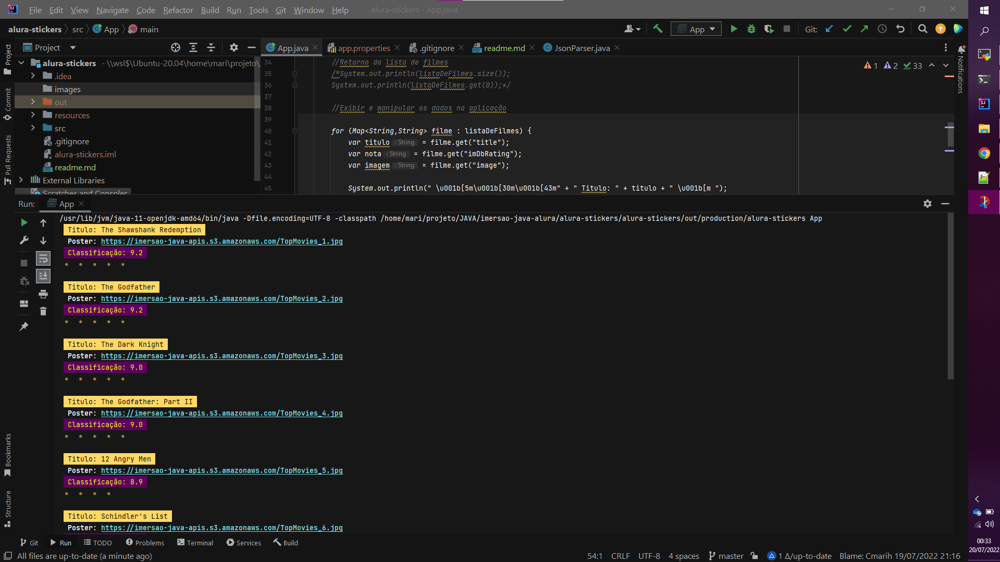
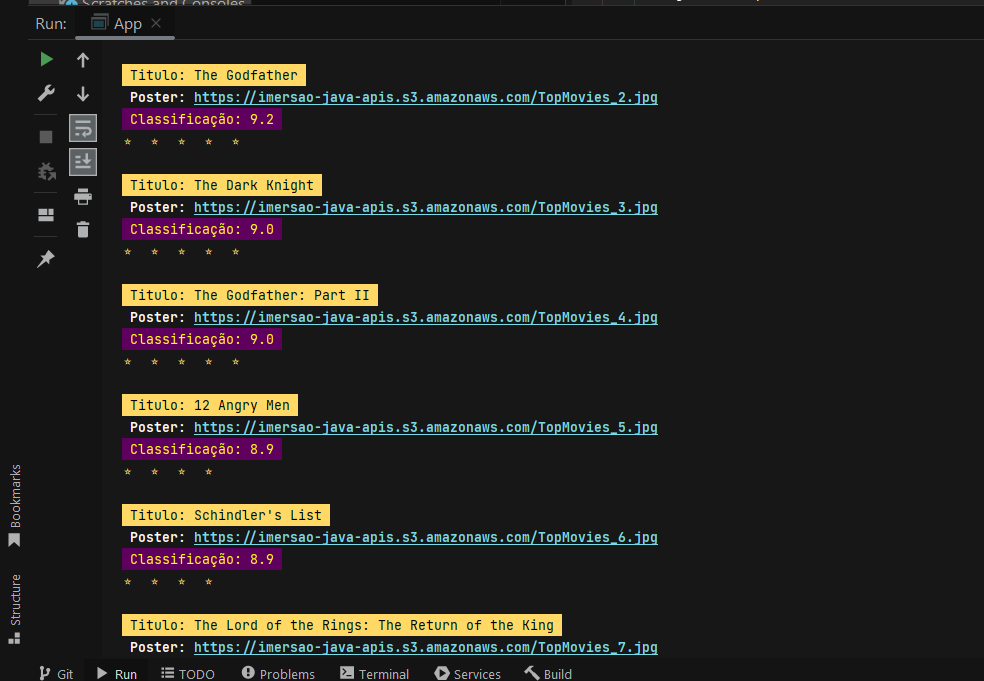

<h1 align="center">Imersão Java - Alura</h1>

---
<h2 > Consumindo uma API de filmes</h2>
  

## 📝 Sumário

- [Sobre](#sobre)
- [Começando](#comecando)
- [Saída](#saida)
- [Ferramentas](#ferramentas)
- [Colaboradores](#colaboradores)

## 🧐 Sobre 

Código desenvolvido na primeira aula da imersão, consiste em consumir uma API de filmes e exibir a
classificação de cada um deles.

## 🏁 Começando 

Necessário conhecimento básico da liguagem Java, utilização do JDK 11

## 🎈 Saída 

Exemplos da saída atual:

## ⛏️ Ferramentas 

- [Java](https://www.oracle.com/java/technologies/downloads/#java11) - Java JDK

## ✍️ Colaboradores 

- [@cmarih](https://github.com/cmarih/) - Trabalho inicial
- [@felipedoamarals](https://github.com/felipedoamarals/) - Configuração da API fora do código.
